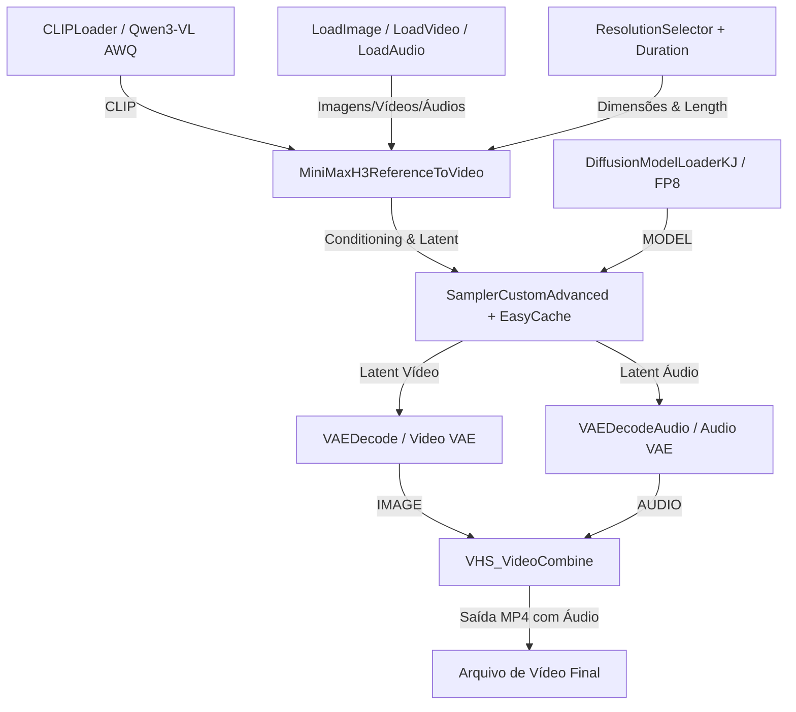

# Relatório de Análise Técnica: MiniMax H3 (Video-to-Video + Image-to-Video em 8GB VRAM) & Guia de Reprodução

## 1. Resumo Executivo

O vídeo analisado (*"MiniMax H3 Video To Video + Image To Video on 8GB VRAM! Free ComfyUI Workflow"*) aborda a implementação e otimização do modelo de inteligência artificial **MiniMax H3** no **ComfyUI**, focando na geração de vídeos omni-modais (vídeo + áudio estéreo nativo) mantendo consistência de personagens, cenários e movimentos em GPUs de entrada/intermediárias com **8GB de VRAM**.

No projeto atual, já temos os templates necessários preparados na pasta [templates](file:///c:/COMFY/templates):
1. **`Minimax_H3_Ref_Final.json`**: Workflow completo de geração utilizando o nó `MiniMaxH3ReferenceToVideo`, codificadores de texto quantizados, EasyCache e VAEs de vídeo e áudio.
2. **`RTX SR Upscaler Video .json`**: Workflow dedicado de pós-processamento e super-resolução via hardware (NVIDIA RTX Video Super Resolution) para aumentar a resolução final para até 4K (3840x2160) sem custo adicional de VRAM durante a fase de amostragem da IA.

---

## 2. Princípios Chave e Otimizações de VRAM para 8GB

O modelo MiniMax H3 é um modelo omni-modal de grande escala que nativamente gera vídeo (até 2K a 24fps) e **áudio estéreo sincronizado** (voz, efeitos sonoros e música ambiente) em um único *forward pass*. Para rodá-lo com sucesso em GPUs de **8GB VRAM**, o vídeo e o template utilizam uma combinação estratégica de técnicas:

> [!NOTE]
> **Técnicas de Otimização de Memória:**
> 1. **Quantização Agressiva dos Pesos:**
>    - **Diffusion Model:** Uso da versão quantizada `minimax_h3_ref2va_pruned_fp8_scaled.safetensors` ou `minimax_h3_ref2va_pruned_int8_convrot.safetensors`.
>    - **Text Encoder:** Uso do modelo multimodal Qwen3-VL 32B quantizado em NVFP4 AWQ (`qwen3vl_32b_minimax_h3_nvfp4_awq.safetensors`) ou INT4 (`qwen3vl_32b_minimax_h3_int4_convrot.safetensors`).
> 2. **Aceleração via EasyCache (`EasyCache` node):**
>    - O nó `EasyCache` (configurado entre 15% e 95% das etapas de amostragem) reutiliza cálculos de tensores repetitivos, acelerando a geração e reduzindo picos de consumo de memória.
> 3. **Redimensionamento Inteligente de Referências (`ref_image_size = "match"`):**
>    - Definir `ref_image_size` para `"match"` reduz o tamanho das imagens de referência para a resolução de amostragem (ex: 0.4 a 0.6 Megapixels), impedindo estouro de VRAM na passagem de tokens de referência.
> 4. **Resolução de Amostragem Baixa + Upscale por Hardware:**
>    - O vídeo é gerado inicialmente em resolução modesta (ex: 864x480 ou 1056x608, 0.4-0.6MP).
>    - Em seguida, utiliza-se a tecnologia **NVIDIA RTX Video Super Resolution (RTX SR)** via tensor cores da GPU para realizar o upscale final até 4K com baixíssimo uso de VRAM.

---

## 3. Análise dos Templates Locais (`templates/`)

### Template 1: [Minimax_H3_Ref_Final.json](file:///c:/COMFY/templates/Minimax_H3_Ref_Final.json)

Este workflow gerencia o pipeline completo de entrada, condicionamento, amostragem e decodificação conjunta (Vídeo + Áudio):

**Principais Nós e Parâmetros:**
* **`DiffusionModelLoaderKJ`**: Carrega o modelo de difusão quantizado (`minimax_h3_ref2va_pruned_fp8_scaled.safetensors`).
* **`EasyCache`**: Intercepta o modelo com threshold `0.2`, `start_percent: 0.15`, `end_percent: 0.95`.
* **`CLIPLoader`**: Tipo `minimax`, utilizando `qwen3vl_32b_minimax_h3_nvfp4_awq.safetensors`.
* **`MiniMaxH3ReferenceToVideo`**: Aceita até 9 imagens de referência (`ref_images`), 3 vídeos (`ref_videos`) e 3 áudios (`ref_audios`).
* **Formatos de Prompt:** Utiliza sintaxe de tags como `<Picture 1>`, `<Video 1>`, `<Audio 1>` para associar dinamicamente os elementos ao prompt textual.
* **`VAEDecode` & `VAEDecodeAudio`**: Decodificam separadamente as metades latentes do tensor empacotado (`minimax_h3_video_vae_fp16.safetensors` e `minimax_h3_audio_vae_fp32.safetensors`).
* **`VHS_VideoCombine`**: Junta os quadros de vídeo decodificados e o áudio decodificado em um container MP4 H.264 a 24 fps.

---

### Template 2: [RTX SR Upscaler Video .json](file:///c:/COMFY/templates/RTX%20SR%20Upscaler%20Video%20.json)

Este workflow de pós-processamento pega o arquivo MP4 gerado no primeiro passo e aplica Super Resolution via GPU NVIDIA RTX:

* **`VHS_LoadVideo`**: Carrega o vídeo MP4 gerado.
* **`RTXVideoSuperResolution`**: Aplica o algoritmo de upscaling da NVIDIA com `resize_type: "target dimensions"`, `width: 3840`, `height: 2160` e `quality: "ULTRA"`.
* **`VHS_VideoCombine`**: Exporta a versão final em 4K mantendo a faixa de áudio original sincronizada.

---

## 4. Guia Passo a Passo para Reproduzir o Conteúdo no Projeto Atual

### Passo 1: Download dos Modelos Necessários
Certifique-se de que os modelos estão baixados e colocados nas pastas corretas em `c:\COMFY\ComfyUI\models\`:

| Tipo | Nome do Arquivo | Pasta de Destino | Link de Download |
|---|---|---|---|
| **Diffusion Model** | `minimax_h3_ref2va_pruned_fp8_scaled.safetensors` | `models/diffusion_models/` | [HuggingFace Comfy-Org](https://huggingface.co/Comfy-Org/MiniMax-H3/resolve/main/diffusion_models/minimax_h3_ref2va_pruned_fp8_scaled.safetensors) |
| **Text Encoder** | `qwen3vl_32b_minimax_h3_nvfp4_awq.safetensors` | `models/text_encoders/` | [HuggingFace Comfy-Org](https://huggingface.co/Comfy-Org/MiniMax-H3/resolve/main/text_encoders/qwen3vl_32b_minimax_h3_nvfp4_awq.safetensors) |
| **Video VAE** | `minimax_h3_video_vae_fp16.safetensors` | `models/vae/` | [HuggingFace Comfy-Org](https://huggingface.co/Comfy-Org/MiniMax-H3/resolve/main/vae/minimax_h3_video_vae_fp16.safetensors) |
| **Audio VAE** | `minimax_h3_audio_vae_fp32.safetensors` | `models/vae/` | [HuggingFace Comfy-Org](https://huggingface.co/Comfy-Org/MiniMax-H3/resolve/main/vae/minimax_h3_audio_vae_fp32.safetensors) |

---

### Passo 2: Executando a Geração de Vídeo + Áudio

1. Abra o ComfyUI executando o script `INICIAR.bat` na raiz (`c:\COMFY`).
2. Arraste e solte o arquivo [Minimax_H3_Ref_Final.json](file:///c:/COMFY/templates/Minimax_H3_Ref_Final.json) na interface do ComfyUI.
3. Configure os nós de entrada:
   - **ResolutionSelector**: Defina `megapixels` como `0.4` ou `0.6` para GPUs de 8GB VRAM (ex: 864x480 ou 1056x608).
   - **Float (Duration)**: Defina a duração desejada em segundos (ex: 5 a 8 segundos).
   - **Imagens / Vídeos de Referência**: Carregue as imagens de personagem/cenário nos nós `LoadImage` e conecte-as a `ref_images.ref_image_0`, `ref_image_1`, etc.
   - **Prompt**: No nó `PrimitiveStringMultiline`, faça referência às entradas usando tags explícitas. Exemplo:
     > *"Use <Video 1> como cena anterior. O personagem de <Picture 1> se aproxima da viatura de <Picture 2>. Som ambiente de chuva fraca e chiado suave de rádio policial."*
4. Clique em **Queue Prompt**.
5. O resultado será salvo automaticamente na pasta `ComfyUI/output/Minimax_h3_Ref/`.

---

### Passo 3: Realizando o Upscale 4K com RTX SR

1. No ComfyUI, carregue o workflow [RTX SR Upscaler Video .json](file:///c:/COMFY/templates/RTX%20SR%20Upscaler%20Video%20.json).
2. No nó `VHS_LoadVideo`, selecione o vídeo MP4 gerado no Passo 2.
3. Certifique-se de que o nó `RTXVideoSuperResolution` está configurado para `width: 3840`, `height: 2160` e `quality: ULTRA`.
4. Clique em **Queue Prompt**. O vídeo upscaleado 4K será gerado em segundos sem estourar a VRAM!

---

## 5. Boas Práticas e Resolução de Problemas

> [!TIP]
> **Dicas de Desempenho:**
> - **Evite resoluções maiores que 0.6MP durante a geração:** Para amostragem em GPUs de 8GB, mantenha entre 0.3MP e 0.6MP no `ResolutionSelector` e deixe o trabalho de alta resolução para o `RTX SR Upscaler`.
> - **Mantenha `ref_image_size = "match"`:** Isso impede que imagens de referência em 4K sejam enviadas intactas para a memória da GPU durante cada etapa do sampler.
> - **Prompting Específico:** Seja altamente descritivo sobre o movimento da câmera, posições dos objetos e elements sonoros desejados para obter a melhor fidelidade omni-modal.
